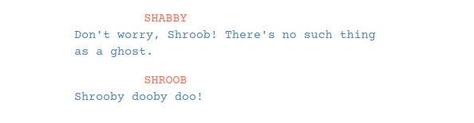
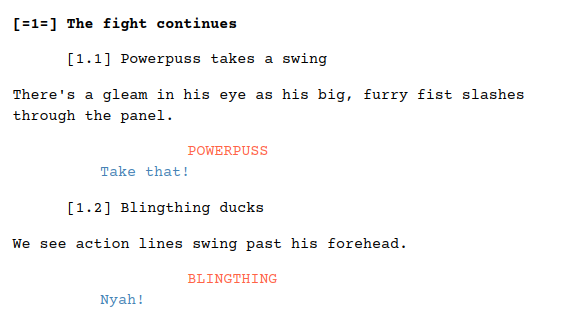
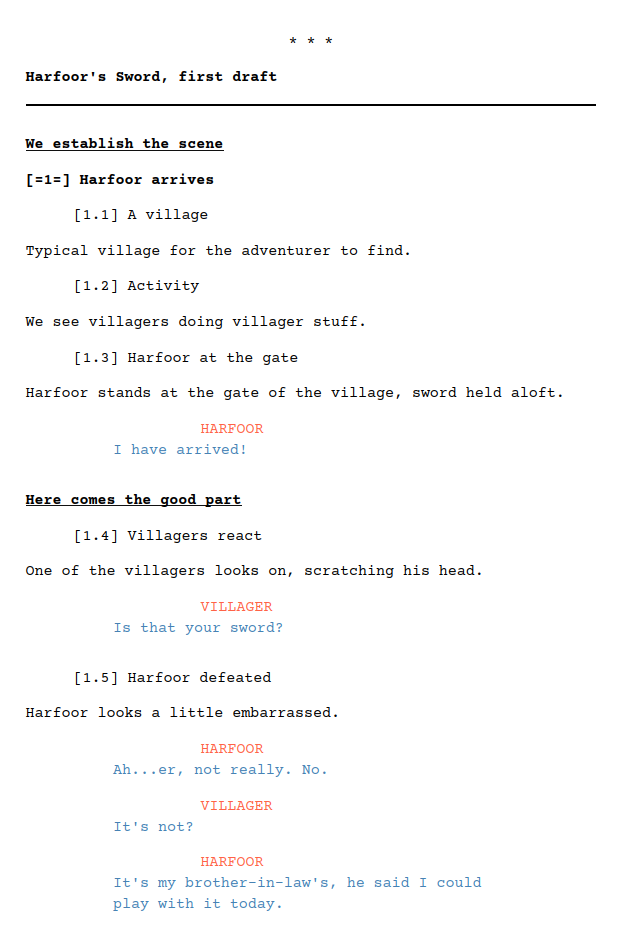

# Skrivko

A formatting and structure system for writing comic books in Markdown.

This is not an application or even a (programming) script. The system consists of a mere CSS file which formats dialogue blocks and sharpens the header structure for dividing scripts into sections, automatically numbering pages and panels, and organizing relevant material, such as notes and reference.

## Markdown

A markdown editor with a markdown preview panel is recommended. Markdown is a popular style of writing because it is incredibly simple, so don't fret if you have no experience with it.

Markdown is much like writing an email. Some people might put astericks around a word for emphasis, like \*this\*.

~~~~~~~~~ markdown
> If you were responding to an email,
> your email client might format the
> markdown you're responding to like this.
~~~~~~~~~

That's all markdown is, a simple guideline for making easy markdown notations while writing. We'll tell you what you need to know as we go along.

## Dialogue blocks

Dialogue blocks similar to movie scripts can be created with blockquotes, the same type we just demonstrated from old emails. Our system assumes you won't use blockquotes for anything else. So don't.

~~~~~~~~~ markdown
> SHABBY
>
>> Don't worry, Shroob! There's no such thing as a ghost.

> SHROOB
>
>> Shrooby dooby doo!
~~~~~~~~~

One > at the beginning of a line begins a blockquote, which should contain your character's name in allcaps. The next line down begins with a *nested blockquote*, which begins with >>.

The result:

The blockquote feature is standard in markdown, meaning every editor will support it. For an alternate method of creating dialogue blocks, we also reserve a less common extension, called the *definition list*.

~~~~~~~~~ markdown
THELMA
: But I still don't get it. Why did Farmer Melon pretend to be a ghost?

MELON
: Well, um, to be perfectly honest... I was bored.

THELMA
: BORED?

MELON
: You get tired of chickens.
~~~~~~~~~

Same type of result:

If a markdown interpreter doesn't recognize definition lists, the dialogue block will tend to resemble lines from a script for a stage play.

~~~~~~~~~ markdown
THELMA : But I still don't get it. Why did Farmer Melon pretend to be a ghost?

MELON : Well, um, to be perfectly honest... I was bored.

THELMA : BORED?

MELON : You get tired of chickens.
~~~~~~~~~

Describing the action and setting, simply type normal paragraphs around the dialogue blocks.

## Headers

It is possible to write a script with the dialogue blocks and avoid headers altogether. But the headers are configured to help build reference and script material together, sort of a poor man's Scrivener. Start using headers as you begin to build more complex documents.

Headers in markdown are created with leading hashtags, one for each level. In markdown, as with HTML, there are six header levels. Normally they simply rank upper or lower.

~~~~~~~~~ markdown
# Header level 1

## Header level 2

### Header level 3

#### Header level 4

##### Header level 5

###### Header level 6
~~~~~~~~~

In this system, headers are used to identify sections and to create automatic page and panel numbering. Each level has a specific specific function. In markdown preview, the visual appearance of the headers will remind you of the functions.

1. The top header resets page numbering, so use it sparingly. Use it, for instance, only to create a notes section and a second section for a script. Use it repeatedly if the document includes many scripts, for an anthology, fragments, drafts, etc.
2. The second-level header creates sections, sub-groups regardless of the page numbering, so it can be used to organize notes/reference and parts of the script itself. For instance, pages can be grouped as different scenes without interrupting the actual flow.
3. Third-level headers can be treated as bullet points or lists within sections. Consider this organization:

~~~~~~~~~ markdown
# Notes

    ## Characters

        ### Heroic Molasses
        ### Villain Q. Public
        ### The bystander
~~~~~~~~~

4. Use fourth-level headers as labels or captions for significant material, like images and tables. Example:

~~~~~~~~~ markdown
### Heroic Molasses

    #### Character design
    #### Relationships
    #### Statistics
~~~~~~~~~

That leaves level 5 and 6 for auto-numbered pages and panels. Since it is repetitive and not particularly helpful to simply say page x, page y, page z and panel panel panel constantly, we use a visual cue to simplify matters.

Page numbers are arranged to look like pages of a book, with the number between the pages:

~~~~~~~~~ markdown
[=1=]
[=2=]
[=3=]
~~~~~~~~~

Panel numbers are decimalized with the page number, to help you keep track of where you are:

~~~~~~~~~ markdown
    [2.1]
    [2.2]
    [2.3]
~~~~~~~~~

Automatic page/panel numbering in action:

Putting it all together in some sample structures:

~~~~~~~~~ markdown
# Harfoor's Sword (header level 1)

## Historical reference (header level 2)

### Pictures of old swords

#### This is a really old sword

#### This one's a little rusty

~~~~~~~~~

Headers interacting with the script:

~~~~~~~~~ markdown
# Harfoor's Sword, first draft

## We establish the scene

##### Harfoor arrives

###### A village

Typical village for the adventurer to find.

###### Activity

We see villagers doing villager stuff.

###### Harfoor at the gate

Harfoor stands at the gate of the village, sword held aloft.

> HARFOOR
>
>> I have arrived!

## Here comes the good part

###### Villagers react

One of the villagers looks on, scratching his head.

> VILLAGER
>
>> Is that your sword?

###### Harfoor defeated

Harfoor looks a little embarrassed.

> HARFOOR
>
>> Ah...er, not really. No.

> VILLAGER
>
>> It's not?

> HARFOOR
>
>> It's my brother-in-law's, he said I could play with it today.
~~~~~~~~~

OK, the sample is silly on purpose. But if you are using an editor with a outliner pane, then the sections will be clickable, which will help you with navigating it later. If you have a something important to note within the script, the section header can act as a bookmark.

## Image handling

Inserting images with markdown is far less intuitive than headers and highlighting, because now we're dealing with attached files. Markdown for images:

~~~~~~~~~ markdown

~~~~~~~~~

The title in quotes is optional and commonly left out. So we'll use it to send formatting notes. Using some of the codes in the tables below, for instance, your markdown may look like this:

~~~~~~~~~ markdown

~~~~~~~~~

code | image alignment
---- | -------------------------------
=    | center a single image on a line
:=   | align left
=:   | align right

attribute       | smallest  | small     | medium    | big       | biggest
--------------- | --------- | --------- | --------- | --------- | -------
image width     | :         | ::        | :::       | ::::      | :::::
image height    | ^         | ^^        | ^^^       | ^^^^      | ^^^^^
border width    | +         | ++        | +++       | ++++      | +++++
round border    | @         | @@        | @@@       | @@@@      | @@@@@

code        | border color (primary and secondary)
----------- | -------------------------------------------------
+blue       | blue
+red        | red
+yellow     | yellow
+green      | green
+purple     | purple
+orange     | orange

## Options

A courier font is recommended (particularly Courier Prime) but you can set your preferred font at the top of the CSS file, and also select your preferred highlight colors for the dialogue blocks.

~~~~~~~~~~~~~~~~ css
:root {
    --font: 'courier prime', 'courier new', 'courier', monospace;
    --code:  'courier prime', 'courier new', 'courier', monospace;
    --character-color:rgb(255,99,71);
    --dialogue-color:rgb(70,130,180);
}
~~~~~~~~~~~~~~~~

## Markdown/text editors

There are many text editors with markdown preview, and some will accomodate this system better than others.

[ReText](https://github.com/retext-project/retext) and [Typora](https://typora.io) allow easy installation. Typora calls it a *theme*, but just drop skrivko.css into the theme folder and off you go. Other editors will allow you to select skrivko.css via a preference dialogue.

[Ghostwriter](https://github.com/wereturtle/ghostwriter) v1 had an easy drop-down for themes, but this functionality was removed in v2. You can however hack this and many other text editors by including the link directly in your document:

~~~~~~~~~~~~~~~~~~~~~~~~~~~~~~~~~~~~~~~~~~~~~~~~~~ html
<link rel="stylesheet" type="text/css" href="path/to/skrivko.css">
    or
<link rel="stylesheet" type="text/css" href="<link file to skrivko.css>">
~~~~~~~~~~~~~~~~~~~~~~~~~~~~~~~~~~~~~~~~~~~~~~~~~~

Any text editor at all can be used if you use your browser to preview. Install the Chrome plugin [Markdown Preview Plus](https://chrome.google.com/webstore/detail/markdown-preview-plus/febilkbfcbhebfnokafefeacimjdckgl) and use its options page to include skrivko.css in its dropdown.
